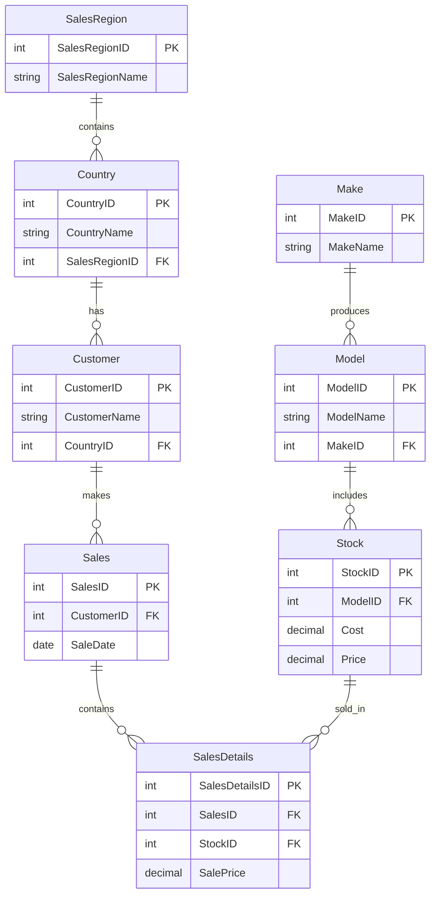

# Project 2.5 - Prestige Cars Normalized Database

## Group Information
- **Group Category:** EOS_grp_2  
- **Group Name:** EOS_grp_2  
- **Course:** CSCI-331  

---

# Prestige Cars Database Project

## Project Overview

This project focused on improving and normalizing the Prestige Cars database by reducing redundant data, improving relational integrity, creating lookup tables, and implementing database design improvements using Microsoft SQL Server.

The project included:
- User Defined Types (UDTs)
- Schema and normalized table creation
- Constraints and relational integrity improvements
- Views and Inline Table-Valued Functions
- Indexing
- Data anomaly identification and correction
- ERD/PDM diagram documentation
- GitHub collaboration and tracking
- Final submission organization

The goal was to redesign the database into a normalized, scalable, and maintainable relational database structure.

---

# Group Members & Work Distribution

| Member | Work Done |
|---|---|
| Frankie Liang | Project planning, GitHub setup, workflow coordination, editing SQL queries to follow updated syntax |
| Prabhjot Kaur | Project planning, reminders, add/remove columns, schema/table creation, backup tables, `.bak` file, README file |
| Salvador Cardoso | User Defined Data Types (UDTs), create tables, constraints, assisted and helped team members |
| Kanwal Jit Singh | No documented contribution |
| Simran Singh | Indexes, PDM diagram |
| Brandon Cho | Presentation, video |
| Amrina Qayyum | Documentation |
| Shuai Wang | No documented contribution |

---

# Main Files

| File | Description |
|---|---|
| `PrestigeCarsDatabaseScript.sql` | Original database script used to create the starting Prestige Cars database |
| `Final_Project2_5_PrestigeCars.sql` | Final combined project SQL script |
| `create_UDT.sql` | Creates reusable User Defined Types and required schemas |
| `create_tables.sql` | Creates normalized tables using the UDTs |
| `load_tables.sql` | Loads/transfers data into the normalized tables |
| `preserve_original_tables.sql` | Preserves original tables before normalization |
| `create_views_and_itvfs.sql` | Creates Views and Inline Table-Valued Functions |
| `createWorkflowStepsTable.sql` | Creates the `Process.WorkflowSteps` table |
| `view_draft.sql` | Draft/work file for views |
| `ClassTimeEOSgrp2PrestigeCars.bak` | Final database backup file |
| `0910_EOSgrp2_PrestigeCars.bak` | Database backup file |
| `0910 -EOS#2 – To-do list for projects 2.5.xlsx` | Project tracking/to-do file |
| `README.md` | Project documentation file |
| ERD/PDM Files | Show database design, keys, relationships, and cardinality |

---

# Project Links

- [To-do List](https://cuny-my.sharepoint.com/:x:/g/personal/frankie_liang64_qmail_cuny_edu/IQBYk-uwedoeSYeQujb7QlusAf3twJ29F5et3pbg5PI9Z4s?e=9sOhLK)
- [PowerPoint Presentation Video](https://youtu.be/vyMzV5Y9M7c)
- [PowerPoint Presentation File](https://1drv.ms/p/c/2c27ee94644c4795/IQDpCYSPsmvXQ7mLMi3wOmRhAWumGkzTs2qpBwlLTOLtjGc?e=ZPemQs)

---

# Project Tasks Completed

- Created `create_UDT.sql`
- Created `create_tables.sql`
- Created `load_tables.sql`
- Created `preserve_original_tables.sql`
- Created `create_views_and_itvfs.sql`
- Created `createWorkflowStepsTable.sql`
- Created `Final_Project2_5_PrestigeCars.sql`
- Created `Process.WorkflowSteps` table
- Created reusable User Defined Types
- Created normalized database tables
- Created normalized lookup tables
- Improved relational integrity
- Replaced repeated text values with relational IDs
- Created Views and Inline Table-Valued Functions
- Added indexes
- Added constraints and reusable UDTs
- Identified and corrected data anomalies
- Created ERD/PDM diagram documentation
- Maintained GitHub repository for version control
- Prepared final backup file for submission
- Prepared presentation file and video demonstration

---

# UDT Work

The project uses reusable User Defined Types (UDTs) for:

- Keys and IDs
- Codes and names
- Address fields
- Money values
- Date/time values
- Boolean fields

Using UDTs improved:

- Consistency
- Reusability
- Maintainability
- Standardization across the database

UDTs help ensure that similar columns across different tables follow the same data type structure. This reduces mistakes and improves the long-term maintainability of the database.

---

# Normalized Tables

The normalized tables include:

- `SalesRegion`
- `Country`
- `Customer`
- `Make`
- `Model`
- `Stock`
- `Sales`
- `SalesDetails`
- `Process.WorkflowSteps`

The design separates data into logical subject areas, reduces redundancy, improves scalability, and strengthens relational integrity by replacing repeated text values with relational IDs and lookup tables.

---

# Database Improvements

## Normalization

The database was improved through normalization by separating repeated data into independent tables. This helped reduce duplicate values and made the database easier to update and maintain.

Normalization improvements included:

- Reduced redundant data
- Improved scalability and consistency
- Implemented relational lookup tables
- Organized data into logical subject areas
- Replaced repeated text values with relational IDs

## Data Integrity

The project also improved data integrity by adding rules and constraints to prevent invalid or inconsistent data.

Data integrity improvements included:

- Added primary keys
- Added foreign keys
- Added unique constraints
- Added default constraints
- Added check constraints
- Improved table relationships
- Enforced business rules and data consistency

## Documentation

The project documentation was updated to explain the database structure, project work distribution, SQL scripts, anomaly correction, diagram explanation, and final deliverables.

Documentation improvements included:

- Maintained GitHub repository for version control
- Organized final submission materials
- Added project task summary
- Added anomaly correction explanation
- Added ERD/PDM diagram documentation

---

# Data Anomalies and Corrections

During the normalization of the Prestige Cars database, several data anomalies were identified. These anomalies could create redundancy, inconsistency, and difficulty in maintaining the database. The project corrected these issues by separating repeated data into normalized tables and applying relational integrity rules.

| Anomaly Type | Problem | Correction |
|---|---|---|
| Redundancy anomaly | Same data repeated many times | Created lookup tables |
| Update anomaly | Same value needed to be updated in many places | Used relational IDs |
| Insert anomaly | New data could not be added independently | Created separate subject-based tables |
| Delete anomaly | Deleting one record could remove useful data | Separated reference and transaction data |
| Integrity anomaly | Invalid or inconsistent data could be entered | Added constraints and UDTs |

---

# ERD/PDM Diagram

The ERD/PDM diagram shows the final normalized structure of the Prestige Cars database. It represents the main tables, primary keys, foreign keys, and relationships between the entities.

---

## Conclusion

The Prestige Cars database was successfully improved through normalization, relational database design enhancements, reusable User Defined Types, constraints, Views/TVFs, indexing, documentation, and data quality improvements. The project demonstrates proper database development practices, improved relational integrity, and effective collaborative team workflow using SQL Server and GitHub.
